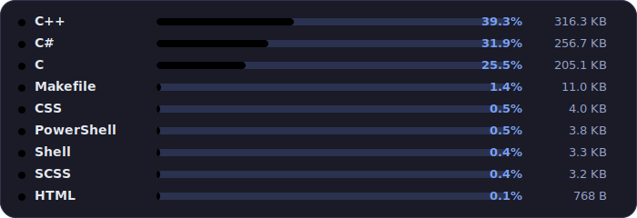

```csharp
Console.WriteLine("ЦИТАТА ПРО ВОЛКА");
```

---

<div align="center">
  <table>
    <tr>
      <td>
        
      </td>
      <td>
        
      </td>
      <td align="right">
        <a href="https://skillicons.dev">
          
        </a>
        <br />
        <a href="https://skillicons.dev">
          
        </a>
        <br />
        <a href="https://skillicons.dev">
          
        </a>
      </td>
    </tr>
  </table>
</div>
